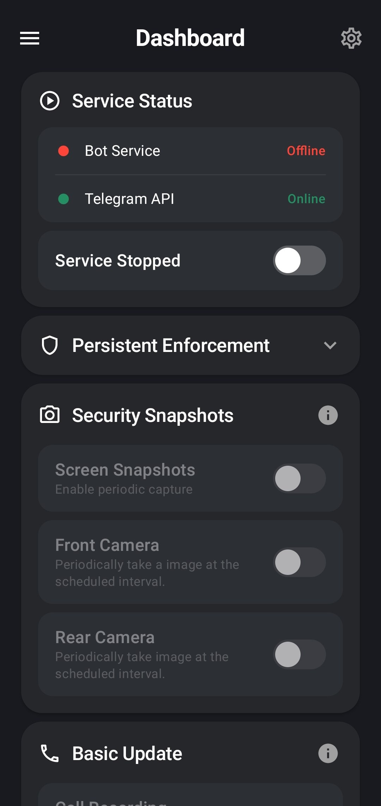
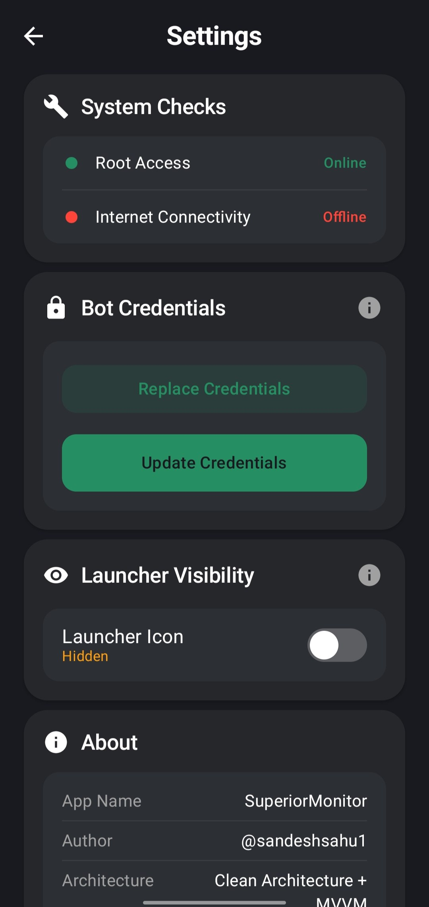
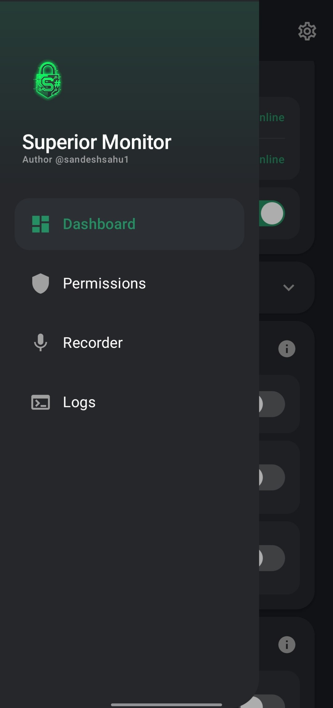

<h1 align="center">
  Superior Monitor
</h1>

  <strong>Advanced Android Telemetry & Remote C2 System via Telegram</strong>

  
  
  
  
  

---

Superior Monitor is a powerful, proof-of-concept Android application designed to monitor and remotely control android device using a Telegram Bot interface. It requires root access to operate and is distributed as a Magisk module for seamless installation as a privileged system application.

> [!WARNING]  
> **DISCLAIMER:** This project was built solely to monitor and control my own device (used as a personal hotspot). While some features extend beyond this original purpose, they were implemented strictly as technical experiments and for skill demonstration. Users are responsible for complying with all applicable laws and regulations.
>  
> **I DO NOT INTEND FOR THIS APPLICATION TO BE USED AS SPYWARE, SURVEILLANCE, PRIVACY VIOLATIONS, ILLIGAL USE  OR TO HARM ANYONE.** I do not authorize its use for any malicious purposes. If you choose to use this software, you bear sole and absolute responsibility for any legal consequences. Please read the full [Notes & Disclaimers](docs/Notes.md) before proceeding.

---

## 📸 Application Snapshots

  
  
  

*More snapshots are available in the [`docs/img/`](docs/img/) directory.*

---

## ✨ Highlights

| Category | Capability |
|:---|:---|
| **Remote C2** | Device control via Telegram Bot commands (`/start`, `/menu`, `/settings`), real-time UI dashboard sync, and remote device popups |
| **Persistent Enforcement** | Auto-enables Wi-Fi, Mobile Data, and Hotspot on boot via root & reflection |
| **Security Snapshots** | Scheduled screen & camera captures with Lock-Screen awareness |
| **Telephony** | Call recording (BCR), SMS interception, and call event logging |
| **Social Monitoring** | Root-level WhatsApp and instagram message interception with network-aware battery polling optimization |
| **Fetch Operations** | On-demand retrieval of device contacts and recent call activity |
| **Stealth** | Hide launcher icon, secret dialer code access, Wi-Fi icon camouflage |
| **Offline Resilience** | Automated path-based offline sync, intelligent media debatching, and ZIP compression |
| **Intrusion Defense** | 3-strike DM blocking, auto-leave unauthorized groups, FIFO memory protection |

---

## 🛠️ Tech Stack

| Layer | Technology |
|:---|:---|
| **Language** | Kotlin 2.0 |
| **UI Framework** | Jetpack Compose + Material 3 |
| **Architecture** | MVVM with ViewModel & StateFlow |
| **Root Library** | [Libsu](https://github.com/topjohnwu/libsu) by topjohnwu |
| **Call Recording** | [Basic Call Recorder (BCR)](https://github.com/chenxiaolong/BCR) by chenxiaolong |
| **Networking** | `OkHttp3` & native `HttpURLConnection` — streamlined third-party dependencies |
| **Persistence** | SharedPreferences with Kotlin property delegates |
| **Background** | Foreground Service, AlarmManager, BroadcastReceiver, ContentObserver |

---

## 📚 Documentation

| Document | Description |
|:---|:---|
| ✨ [**Features & Commands**](docs/Features.md) | Complete breakdown of all capabilities, stealth features, offline mechanics, and Telegram bot commands |
| 📥 [**Installation Guide**](docs/Guide.md) | User installation and building from source |
| 📝 [**Notes & Bugs**](docs/Notes.md) | Important disclaimers, known limitations |
| 🏗️ [**System Architecture**](docs/Architecture.md) | Component structure, directory layout, and deep system integrations |
| 🔧 [**Backend Mechanics**](docs/Backend.md) | Failsafe logic, SQLite WAL handling, audio focus management, and zero-data-loss execution loops |

---

## 🙏 Credits & Acknowledgments

This project relies on the incredible work of the open-source community:

- **Root Library**: [Libsu](https://github.com/topjohnwu/libsu) by [topjohnwu](https://github.com/topjohnwu)
- **Call Recording Engine**: [Basic Call Recorder (BCR)](https://github.com/chenxiaolong/BCR) by [chenxiaolong](https://github.com/chenxiaolong)

---

## ⚖️ License

This project is licensed under the **GNU General Public License v3.0** with the **Commons Clause** condition. 

This means:
- ✅ You can view, modify, and use this code.
- ❌ **You CANNOT sell this software** or provide it as a paid service.
- ❌ This project cannot be used for commercial distribution or corporate earnings.

See the full [LICENSE](LICENSE) file for exact terms, and the [Notes & Disclaimers](docs/Notes.md) for full legal information.

---

  Built with ❤️ by <a href="https://gitlab.com/sandeshsahu">@sandeshsahu1</a>

