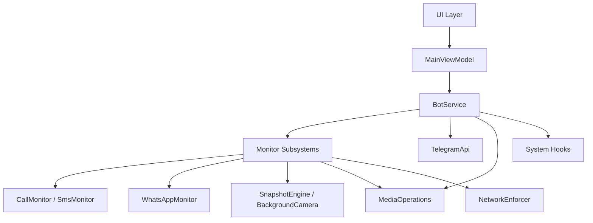

<h1 align="center">
  System Architecture
</h1>

<p align="center">
  <strong>Internal Mechanics, Component Structure & Integrations</strong>
</p>

---

> [!NOTE]
> This document provides a comprehensive overview of the internal mechanisms, component structure, and architectural patterns implemented within the Superior Monitor system.

---

## 1. High-Level Architecture



---

## 2. Core Directory Structure

```
app/src/main/java/com/system/superiormonitor/
├── bot/                    # Telegram C2 orchestration layer
│   ├── BotService.kt       # Central foreground service
│   ├── BotCommands.kt      # Command parser & routing
│   ├── BotActions.kt       # Remote side-effects & device control
│   ├── OfflineManager.kt   # Offline queue & categorical sync pipeline
│   ├── BotMessages.kt      # Unified text strings & templates
│   ├── BotMarkups.kt       # Telegram Inline Keyboards JSON definitions
│   └── TelegramApi.kt      # Networking singleton
├── monitor/                # Background data extraction & subsystems
│   ├── CallMonitor.kt      # Telephony event interception
│   ├── SmsMonitor.kt       # SMS interception (incoming + outgoing)
│   ├── WhatsAppMonitor.kt  # Root-level database extraction via stat polling
│   ├── WABusinessMonitor.kt# Root-level database extraction via stat polling
│   ├── InstagramMonitor.kt # Root-level database extraction via stat polling
│   ├── KeyEvents.kt        # Key events scheduler via AlarmManager
│   ├── MediaOperations.kt  # On-demand media captures & mic recording
│   ├── FetchOperations.kt  # On-demand retrieval of contacts & call logs
│   ├── SnapshotEngine.kt   # Scheduled snapshots via AlarmManager
│   ├── BackgroundCamera.kt # camera captures
│   └── NetworkEnforcer.kt  # Persistent Wi-Fi/Data/Hotspot enforcement
├── ui/                     # Jetpack Compose presentation layer
│   ├── AppScreen.kt        # Navigation scaffold & drawer
│   ├── DashboardScreen.kt  # Main dashboard with feature toggles
│   ├── PermissionsScreen.kt # Centralized permission management
│   ├── SettingsScreen.kt   # Bot credentials & launcher visibility
│   ├── BCRSettingsScreen.kt # Call recorder configuration
│   ├── LogsScreen.kt       # Real-time log viewer
│   ├── Components.kt       # Reusable UI components
│   ├── MainViewModel.kt    # MVVM ViewModel & StateFlow management
│   ├── PopupActivity.kt    # Dialog interface for remote messages
│   └── CamouflageActivity.kt # Disguised entry point
├── data/                   # Persistence & models
│   ├── PrefsManager.kt     # SharedPreferences with Kotlin delegates
│   └── TelegramModels.kt   # Telegram API data classes
├── theme/                  # Design system
│   └── Theme.kt            # Material 3 color tokens & typography
├── util/                   # Utilities & telemetry
│   ├── LogManager.kt       # Centralized logging with StateFlow
│   └── TelemetryCollector.kt # Hardware & network metrics
├── receiver/               # System broadcast receivers
│   ├── BootReceiver.kt     # ACTION_BOOT_COMPLETED handler
│   ├── DialerCodeReceiver.kt # Secret dialer code interceptor
│   └── MonitorDeviceAdminReceiver.kt # Device Administrator receiver
├── service/                # System services
│   ├── MonitorAccessibilityService.kt # Accessibility service hook
│   └── MonitorNotificationListenerService.kt # Notification listener
├── MainActivity.kt         # Entry point & Compose host
└── SuperiorMonitorApp.kt   # Application class
```

---

## 3. Component Details

### 3.1. `bot/` — Telegram Orchestration Layer

Handles all real-time communication between the device and the Telegram Bot API.

| File | Responsibility |
|:---|:---|
| **`BotService.kt`** | **The Lifecycle Manager** — Lightweight foreground service. Manages the Telegram polling loop, asynchronously initializes background monitors (preventing UI blocking), and listens for network changes. |
| **`BotCommands.kt`** | **The Router** — Parses raw Telegram updates and routes commands/callbacks. Intentionally and silently drops non-command media to keep the chat clean. Fully decoupled from string building. |
| **`BotActions.kt`** | **The Controller** — Single source of truth for actions and side-effects. Centralizes authorization/security (`handleUnauthorizedAccess()`), remote popups, and device control. |
| **`OfflineManager.kt`**| **The Synchronization Engine** — Path-based categorical sync pipeline handling text logs, resilient ZIP compression for snapshots, and rate-limit safe sequential syncing for audio. |
| **`BotMessages.kt`** | **The View / Text Dictionary** — Single source of truth for all text. Contains ALL user-facing strings, message templates, and captions. |
| **`BotMarkups.kt`** | **The View / UI Structure** — Single source of truth for all Telegram Inline Keyboards. Contains ONLY the `JSON_MARKUP` definitions matching the exact structure of `BotMessages.kt`. |
| **`TelegramApi.kt`** | **Networking Singleton** — Uses `OkHttpClient` for all Telegram API requests. Contains API reachability validation, markdown escaping, and file upload logic. |

---

### 3.2. `monitor/` — Background Data Extraction

Responsible for gathering telemetry, media, and intercepting device events.

| File | Responsibility |
|:---|:---|
| **`CallMonitor.kt`** | Hooks into the Android Telephony framework to capture call events. Uses `OfflineManager.sendOrQueue()` for offline resilience and `BotMessages` for strings. |
| **`SmsMonitor.kt`** | Monitors incoming/outgoing SMS traffic. Captures messages with debounce + mutex locking, delegating offline handling to `OfflineManager`. |
| **`WhatsAppMonitor.kt`** | Uses root (`su`) to continuously poll `msgstore.db` via `stat`. If modified, pulls the raw database and queries via `sqlite3` and `OPEN_READWRITE` for safe WAL checkpoints. Relies on `OfflineManager` for robust offline logging. |
| **`WABusinessMonitor.kt`** | Identical architecture to WhatsAppMonitor, but targeted at the WhatsApp Business package (`com.whatsapp.w4b`). |
| **`InstagramMonitor.kt`** | Polls `direct.db` via `stat` (standard SQLite), dynamically handles JSON BLOB parsing, extracts usernames, deduplicates via timestamp baselining, and routes to offline queues. |
| **`KeyEvents.kt`** | Orchestrates scheduled Key Events uploads using `AlarmManager` with automatic fallback to inexact alarms. |
| **`MediaOperations.kt`** | Handles on-demand media captures and duration-based mic recordings. Fully decoupled, it uses `BotMessages` for formatting captions. |
| **`FetchOperations.kt`** | Handles on-demand asynchronous retrieval of device contacts and full call activity history. Generates flat-file backups and queues to `OfflineManager` if disconnected. |
| **`SnapshotEngine.kt`** | Orchestrates scheduled snapshots using `AlarmManager` with `setExactAndAllowWhileIdle()` and automatic fallback to inexact alarms on Android 14+. Also contains the `SnapshotScheduler` class for scheduling management. |
| **`BackgroundCamera.kt`** | Handles camera captures using `CameraManager` with thread-safe filename separation to prevent file corruption during simultaneous front/rear captures. |
| **`NetworkEnforcer.kt`** | Persistent network enforcement module. Evaluates connectivity state on boot and monitors for changes. Re-enables Wi-Fi, Mobile Data, or Hotspot via root commands and Java Proxy Reflection into `TetheringManager`. Includes built-in fail-safes that auto-disable failing toggles. |

> [!WARNING]
> **Experimental Feature**: The `NetworkEnforcer` heavily manipulates restricted internal Android APIs (e.g., dynamic proxy generation for `TetheringManager` callbacks). This feature was engineered and verified on a Realme device running Android 11. Due to OEM customizations and varying Android versions, this capability **may not work universally** and could cause unexpected behavior, system UI crashes, or soft reboots. The enforcer includes automatic fail-safe logic to disable problematic toggles on boot failure.

---

### 3.3. `ui/` — Jetpack Compose Presentation Layer

Provides a modern, visually cohesive UI using Jetpack Compose and Material 3.

| File | Responsibility |
|:---|:---|
| **`AppScreen.kt`** | The main navigation scaffold with a custom `ModalNavigationDrawer`, persistent top bar, and animated screen transitions between all pages. |
| **`DashboardScreen.kt`** | The primary dashboard displaying all feature toggles: Service Status, Persistent Enforcement (collapsible), Security Snapshots, Basic Updates, and Social Updates. |
| **`PermissionsScreen.kt`** | Centralized permission management UI. Features an interactive, on-demand Root Access button that safely requests and displays root status without freezing the app on startup. |
| **`SettingsScreen.kt`** | Bot credential configuration (Token & Chat ID), launcher visibility toggle with confirmation dialogs, system checks, and About section. |
| **`BCRSettingsScreen.kt`** | Call recorder settings: audio source, encoding format, sampling rate, bitrate, and recording behavior configuration. |
| **`LogsScreen.kt`** | Real-time log viewer powered by `LogManager`'s `StateFlow`, with log clearing functionality and category-based display. |
| **`Components.kt`** | Reusable UI components: `OuterCard`, `InnerListHost`, `TactileSwitch`, `SectionTitle`, and other styled building blocks. |
| **`MainViewModel.kt`** | MVVM ViewModel managing all UI state via `StateFlow`. Handles permission checks, feature toggle persistence, service lifecycle coordination, and implements secure Root Persistence caching to survive Android memory kills. |
| **`PopupActivity.kt`** | A transparent activity used to display remote popup messages sent from the Telegram Bot directly on the device screen. |
| **`CamouflageActivity.kt`** | A disguised entry point used when the main launcher icon is hidden. Redirects to native Wi-Fi settings to maintain the camouflage. |

---

### 3.4. `data/` — Persistence & Models

| File | Responsibility |
|:---|:---|
| **`PrefsManager.kt`** | Centralized `SharedPreferences` manager using Kotlin property delegates (`StringPref`, `BooleanPref`) for clean, type-safe configuration persistence. |
| **`TelegramModels.kt`** | Kotlin data classes representing the Telegram Bot API schema (`UpdateResponse`, `Message`, `CallbackQuery`, etc.). |

---

### 3.5. `theme/` — Design System

| File | Responsibility |
|:---|:---|
| **`Theme.kt`** | Defines the complete Material 3 design system: custom color tokens (dark theme), typography scales, and the `SuperiorMonitorTheme` composable wrapper. |

---

### 3.6. `util/` — Utilities & Telemetry

| File | Responsibility |
|:---|:---|
| **`LogManager.kt`** | Centralized logging utility using a Kotlin `StateFlow` to push real-time internal logs directly to the Compose UI. Supports categorized log entries. |
| **`TelemetryCollector.kt`** | Gathers live system metrics asynchronously (`Dispatchers.IO`): CPU frequency, thermal zones, network signal strength (RSRP), and connectivity stats. Specifically avoids unstable OEM-specific metrics (like battery health) for universal compatibility. |

---

### 3.7. `receiver/` & `service/` — System Hooks

| File | Responsibility |
|:---|:---|
| **`BootReceiver.kt`** | Listens for `ACTION_BOOT_COMPLETED` to restart the `BotService` background service after a device reboot. |
| **`DialerCodeReceiver.kt`** | Intercepts the secret dialer code (`*#*#677#*#*`) to unhide the application icon or launch the interface when hidden. |
| **`MonitorDeviceAdminReceiver.kt`** | Device Administrator receiver enabling advanced device management capabilities. |
| **`MonitorAccessibilityService.kt`** | **[Stub]** Currently an empty placeholder. Does not perform screen captures (handled by `SnapshotEngine.kt`) or advanced interactions. |
| **`MonitorNotificationListenerService.kt`** | **[Stub]** Currently an empty placeholder intended for future push notification interception. |

---

## 4. Basic Call Recorder (BCR) Integration

The core call recording engine is integrated directly from the open-source [Basic Call Recorder (BCR)](https://github.com/chenxiaolong/BCR) repository.

> **Credits**: A huge thanks to [chenxiaolong](https://github.com/chenxiaolong) for developing the original BCR project, which provides the robust native call recording foundation used here.

- **Workflow**: When a call is recorded, BCR generates the `.opus`/`.m4a` file. Superior Monitor intercepts this via a direct custom patch in BCR's `OutputDirUtils.kt`, which triggers `BotService` via an explicit foreground service intent (`ACTION_UPLOAD_RECORDING`). `BotService` then instantly uploads the recording to Telegram before moving it to persistent storage.

---

## 5. Advanced Fallback & Offline Queue Mechanics

Superior Monitor handles intermittent network connectivity gracefully through a multi-phase strategy:

| Phase | Strategy |
|:---|:---|
| **Detection** | `BotService` uses `ConnectivityManager.NetworkCallback` to detect outages. |
| **Queuing** | Media goes to `offline/` hierarchy; text logs append to persistent files. |
| **Recovery** | Waits exactly 5s for DNS/Socket stabilization. Intercepts API failures in real-time to prevent data loss. |
| **Trickle-Sync** | Sequential uploads with rate-limit mitigation (`HTTP 429`). |

### Recovery Sequence

1. **Detection**: `BotService` actively monitors network state via `ConnectivityManager.NetworkCallback`. When offline, the polling loop enters deep sleep.
2. **Offline Queuing**:
   - Media (snapshots, camera shots) are routed to a structured `offline/` folder hierarchy.
   - Text logs (calls, SMS, WhatsApp) are appended to persistent text files (e.g., `offline_calls.txt`).
   - Fetch Backups (contacts, call activity) are saved as individual flat files in their respective `offline/` folders.
   - Call recordings (BCR) are routed to offline folders.
   - **API Failure Interception**: If the device is online but the API rejects the message (ISP block/DNS failure), `BotService` intercepts the boolean failure and routes directly to offline queues.
3. **Recovery Sequence**: Upon network restoration, `BotService` waits exactly 5 seconds for DNS and sockets to stabilize, and validates Telegram API health before initiating a trickle-sync.
4. **Trickle-Sync Strategy**:
   - **Text & Data Logs**: Lightweight files (SMS, calls, WhatsApp, and Fetch backups) are uploaded sequentially with a 2-second delay and immediately deleted upon success.
   - **Sequential Audio**: Heavy files (Call recordings, MediaOps) are strictly decoupled from batching and uploaded sequentially with a 2-second delay to respect Telegram rate limits (`HTTP 429`).
   - **Batched Snapshots**: Automated evaluation detects if > 4 snapshots exist in the queue. If so, they are natively compressed into a ZIP archive for bulk upload.
   - **Zero-Loss Retention**: If any upload fails, the local cache safely retains the file in the `offline` directory for the next attempt.

---

<p align="center">
  <sub>Built with ❤️ by <a href="https://gitlab.com/sandeshsahu">@sandeshsahu</a></sub>
</p>