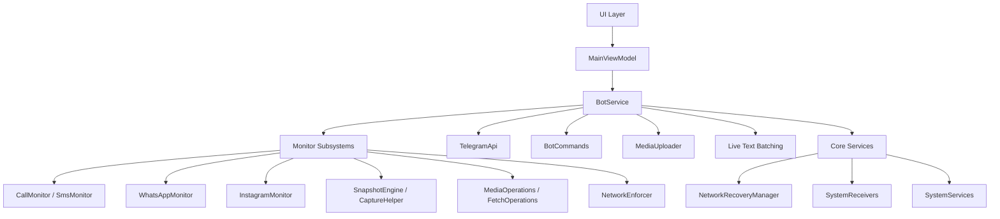

<h1 align="center">
  System Architecture
</h1>

<p align="center">
  <strong>Internal Mechanics, Component Structure & Integrations</strong>
</p>

---

> [!NOTE]
> This document provides a comprehensive overview of the internal mechanisms, component structure, and architectural patterns implemented within the Superior Monitor system.

---

## 1. High-Level Architecture



---

## 2. Core Directory Structure

```
app/src/main/java/com/system/superiormonitor/
├── bot/                        # Telegram C2 orchestration layer
│   ├── BotService.kt           # Central foreground service & live text batching
│   ├── BotCommands.kt          # Command parser & routing
│   ├── BotActions.kt           # Remote side-effects & device control
│   ├── OfflineManager.kt       # Offline queue & categorical sync pipeline
│   ├── MediaUploader.kt        # Universal media upload API with offline fallback
│   ├── BotMessages.kt          # Unified text strings & templates
│   ├── BotMarkups.kt           # Telegram Inline Keyboards via type-safe DSL
│   └── TelegramApi.kt          # Networking singleton
├── core/                       # Platform integration & system services
│   ├── CaptureHelper.kt        # Unified root capture engine (screencap & camera)
│   ├── Diagnostics.kt          # LogManager & TelemetryCollector
│   ├── NetworkRecoveryManager.kt # Connectivity monitoring & recovery sequencing
│   ├── SystemManager.kt        # OS permission checks & launcher visibility
│   ├── SystemReceivers.kt      # Broadcast receivers (Boot, Dialer, DeviceAdmin, AppInstall)
│   ├── SystemServices.kt       # AccessibilityService (keylogger) & NotificationListener
│   └── UtilityActivities.kt    # PopupActivity & CamouflageActivity
├── monitor/                    # Background data extraction & subsystems
│   ├── CallMonitor.kt          # Telephony event interception
│   ├── SmsMonitor.kt           # SMS interception (incoming + outgoing)
│   ├── WhatsAppMonitor.kt      # Root-level database extraction (Normal & Business variants)
│   ├── InstagramMonitor.kt     # Root-level Instagram DM extraction
│   ├── KeyEvents.kt            # Key events scheduler via AlarmManager
│   ├── MediaOperations.kt      # On-demand media captures & mic recording
│   ├── FetchOperations.kt      # On-demand retrieval of contacts & call logs
│   ├── SnapshotEngine.kt       # Scheduled snapshots & SnapshotScheduler
│   └── NetworkEnforcer.kt      # Persistent Wi-Fi/Data/Hotspot enforcement
├── ui/                         # Jetpack Compose presentation layer
│   ├── AppScreen.kt            # Navigation scaffold & drawer
│   ├── DashboardScreen.kt      # Main dashboard with feature toggles
│   ├── PermissionsScreen.kt    # Centralized permission management
│   ├── SettingsScreen.kt       # Bot credentials & launcher visibility
│   ├── BCRSettingsScreen.kt    # Call recorder configuration
│   ├── LogsScreen.kt           # Real-time log viewer
│   ├── Components.kt           # Reusable UI components
│   └── MainViewModel.kt        # MVVM ViewModel & StateFlow management
├── data/                       # Persistence & models
│   ├── PrefsManager.kt         # SharedPreferences with Kotlin delegates
│   └── TelegramModels.kt       # Telegram API data classes
├── theme/                      # Design system
│   └── Theme.kt                # Material 3 color tokens & typography
├── MainActivity.kt             # Entry point & Compose host
└── SuperiorMonitorApp.kt       # Application class
```

---

## 3. Component Details

### 3.1. `bot/` — Telegram Orchestration Layer

Handles all real-time communication between the device and the Telegram Bot API.

| File | Responsibility |
|:---|:---|
| **`BotService.kt`** | **The Lifecycle Manager** — Foreground service managing the Telegram polling loop, monitor initialization, and the live text batching engine. Uses `ConcurrentHashMap`-based message buffers, per-source `throttleJobs`, and a global `sendMutex` to debounce, serialize, and batch all outbound notifications. Uses a generic `handleMonitorToggle()` function and a Kotlin `when` tree for `onStartCommand` intent routing. |
| **`BotCommands.kt`** | **The Router** — Parses raw Telegram updates and routes commands/callbacks. Silently drops non-command media to keep the chat clean. Fully decoupled from string building. |
| **`BotActions.kt`** | **The Controller** — Single source of truth for actions and side-effects. Centralizes authorization/security (`handleUnauthorizedAccess()`), remote popups, and device control. |
| **`OfflineManager.kt`**| **The Synchronization Engine** — Path-based categorical sync pipeline handling text logs, resilient ZIP compression for snapshots (batches if > 3), and rate-limit safe sequential syncing for audio. Uses a private `queueOnlyInternal()` method for DRY file-write operations. |
| **`MediaUploader.kt`** | **The Upload Gateway** — Universal API for `uploadDocument`, `uploadDocumentUri`, and `uploadPhoto` requests. Automatically routes failed media to `OfflineManager` via `moveToOfflineQueue()` when a `fallbackOfflineSubdir` is provided. Also handles legacy intent-based uploads for snapshots, call recordings, and key events. |
| **`BotMessages.kt`** | **The View / Text Dictionary** — Single source of truth for all text. Uses `buildMenuHeader()` templates for consistent menu formatting, `buildSocialUpdateMessage()` for WhatsApp/Instagram messages, `buildOfflineSyncCaption()` for unified offline labels, and `formatFeatureState()` for standardized UI status strings. |
| **`BotMarkups.kt`** | **The View / UI Structure** — Single source of truth for all Telegram Inline Keyboards. Uses a type-safe `inlineKeyboard { row { button() } }` Kotlin DSL built on `org.json.JSONObject` to guarantee JSON syntax validity. |
| **`TelegramApi.kt`** | **Networking Singleton** — Uses `OkHttpClient` for all Telegram API requests. Contains API reachability validation, `escapeMarkdown()` for safe string interpolation, and file upload logic. |

---

### 3.2. `core/` — Platform Integration & System Services

Infrastructure layer providing OS-level hooks, diagnostics, broadcast handling, and shared capture logic.

| File | Responsibility |
|:---|:---|
| **`CaptureHelper.kt`** | **Root Capture Engine** — Unified execution layer for root-based screencap (`screencap -p`) and camera captures (`CameraManager`). Extracted from formerly duplicated logic in `MediaOperations.kt` and `SnapshotEngine.kt`. Enforces lock screen rules: on-demand screenshots and scheduled captures fail on locked screens; on-demand cameras bypass the lock screen. |
| **`Diagnostics.kt`** | **Logging & Telemetry** — Contains `LogManager` (centralized logging utility using `StateFlow` to push categorized real-time logs to the Compose UI, with automatic error mirroring) and `TelemetryCollector` (gathers live system metrics asynchronously: CPU frequency, thermal zones, cellular signal strength, battery, storage, and carrier info via root commands). |
| **`NetworkRecoveryManager.kt`** | **Network Recovery** — Monitors connectivity via `ConnectivityManager.NetworkCallback`. Upon network restoration, waits 5 seconds for DNS/socket stabilization, validates Telegram API health, sends a connection-restored notification with telemetry, and triggers the full offline queue sync pipeline. |
| **`SystemManager.kt`** | **OS Permissions & Launcher** — Encapsulates all permission state queries (root, Device Admin, Accessibility, Notification Listener, camera, SMS, contacts, etc.) and controls launcher icon visibility with camouflage activity fallback. |
| **`SystemReceivers.kt`** | **Broadcast Receivers** — Contains `BootReceiver` (restarts `BotService` on `ACTION_BOOT_COMPLETED`), `DialerCodeReceiver` (secret dialer code `*#*#677#*#*` to unhide the app), `MonitorDeviceAdminReceiver` (Device Administrator), and `AppInstallReceiver` (dynamically registered by `BotService` for fresh install/removal alerts, with update filtering via `Intent.EXTRA_REPLACING`). |
| **`SystemServices.kt`** | **Accessibility & Notifications** — Contains `MonitorAccessibilityService` (key event interception via `AccessibilityEvent`, batches keystrokes per-app and flushes to offline text files on screen-off or app switch) and `MonitorNotificationListenerService` (connected listener for future notification processing). |
| **`UtilityActivities.kt`** | **Utility Activities** — Contains `PopupActivity` (transparent activity for remote popup messages from Telegram) and `CamouflageActivity` (disguised entry point that redirects to Wi-Fi settings). |

---

### 3.3. `monitor/` — Background Data Extraction

Responsible for gathering telemetry, media, and intercepting device events. All monitors establish a fresh baseline ID on startup and only process new events.

| File | Responsibility |
|:---|:---|
| **`CallMonitor.kt`** | Hooks into the Android Telephony framework to capture call events. Uses `OfflineManager.sendOrQueue()` for offline resilience and `BotMessages` for strings. |
| **`SmsMonitor.kt`** | Monitors incoming/outgoing SMS traffic. Captures messages with debounce + mutex locking, delegating offline handling to `OfflineManager`. |
| **`WhatsAppMonitor.kt`** | Uses root (`su`) to continuously poll `msgstore.db` via `stat`. Serves both WhatsApp and WhatsApp Business through the `WhatsAppVariant` enum (`NORMAL`/`BUSINESS`), which parameterizes the package name, log tag, directory name, and SharedPreferences keys. Uses `context.filesDir` as the temporary database workspace to bypass Android's FUSE filesystem isolation. Performs `chown` after root-copy for safe SQLite `OPEN_READWRITE` WAL recovery. Supports both modern (`jid_map` with LID resolution) and legacy SQL query schemas with automatic fallback. |
| **`InstagramMonitor.kt`** | Polls `direct.db` via `stat` (standard SQLite), dynamically handles JSON BLOB parsing, extracts usernames, deduplicates via timestamp baselining, and routes to offline queues. Uses `context.filesDir` workspace and `chown` for WAL recovery, matching WhatsApp's bypass pattern. |
| **`KeyEvents.kt`** | Orchestrates scheduled Key Events uploads using `AlarmManager` with automatic fallback to inexact alarms. |
| **`MediaOperations.kt`** | Handles on-demand media captures (screenshot, front/rear camera) and duration-based mic recordings. Delegates root capture execution to `CaptureHelper`. Uses `MediaUploader` for all uploads with offline fallback. |
| **`FetchOperations.kt`** | Handles on-demand asynchronous retrieval of device contacts and full call activity history. Generates flat-file backups and queues to `OfflineManager` via `MediaUploader` if disconnected. |
| **`SnapshotEngine.kt`** | Orchestrates scheduled snapshots using `AlarmManager` with `setExactAndAllowWhileIdle()` and automatic fallback to inexact alarms on Android 14+. Contains the `SnapshotScheduler` class for scheduling management. Delegates root capture execution to `CaptureHelper`. |
| **`NetworkEnforcer.kt`** | Persistent network enforcement module. Evaluates connectivity state on boot and monitors for changes. Re-enables Wi-Fi, Mobile Data, or Hotspot via root commands and Java Proxy Reflection into `TetheringManager`. Includes built-in fail-safes that auto-disable failing toggles. |

> [!WARNING]
> **Experimental Feature**: The `NetworkEnforcer` heavily manipulates restricted internal Android APIs (e.g., dynamic proxy generation for `TetheringManager` callbacks). This feature was engineered and verified on a Realme device running Android 11. Due to OEM customizations and varying Android versions, this capability **may not work universally** and could cause unexpected behavior, system UI crashes, or soft reboots. The enforcer includes automatic fail-safe logic to disable problematic toggles on boot failure.

---

### 3.4. `ui/` — Jetpack Compose Presentation Layer

Provides a modern, visually cohesive UI using Jetpack Compose and Material 3.

| File | Responsibility |
|:---|:---|
| **`AppScreen.kt`** | The main navigation scaffold with a custom `ModalNavigationDrawer`, persistent top bar, and animated screen transitions between all pages. |
| **`DashboardScreen.kt`** | The primary dashboard displaying all feature toggles: Service Status, Persistent Enforcement (collapsible), Security Snapshots, Basic Updates, and Social Updates. Uses `SuperiorWarningDialog` from `Components.kt` for all warnings. |
| **`PermissionsScreen.kt`** | Centralized permission management UI. Features an interactive, on-demand Root Access button that safely requests and displays root status without freezing the app on startup. |
| **`SettingsScreen.kt`** | Bot credential configuration (Token & Chat ID), launcher visibility toggle with confirmation dialogs, system checks, and About section. |
| **`BCRSettingsScreen.kt`** | Call recorder settings: audio source, encoding format, sampling rate, bitrate, and recording behavior configuration. |
| **`LogsScreen.kt`** | Real-time log viewer powered by `LogManager`'s `StateFlow`, with log clearing functionality and category-based display. |
| **`Components.kt`** | Reusable UI components: `OuterCard`, `InnerListHost`, `TactileSwitch`, `SectionTitle`, `SuperiorWarningDialog`, and other styled building blocks. |
| **`MainViewModel.kt`** | MVVM ViewModel managing all UI state via `StateFlow`. Handles permission checks, feature toggle persistence, service lifecycle coordination, and implements secure Root Persistence caching to survive Android memory kills. Uses unified `currentWarningTitle`/`currentWarningMessage` state for dialog management. |

---

### 3.5. `data/` — Persistence & Models

| File | Responsibility |
|:---|:---|
| **`PrefsManager.kt`** | Centralized `SharedPreferences` manager using Kotlin property delegates (`StringPref`, `BooleanPref`) for clean, type-safe configuration persistence. |
| **`TelegramModels.kt`** | Kotlin data classes representing the Telegram Bot API schema (`UpdateResponse`, `Message`, `CallbackQuery`, etc.). |

---

### 3.6. `theme/` — Design System

| File | Responsibility |
|:---|:---|
| **`Theme.kt`** | Defines the complete Material 3 design system: custom color tokens (dark theme), typography scales, and the `SuperiorMonitorTheme` composable wrapper. |

---

## 4. Live Text Batching Mechanism

All real-time text notifications (WhatsApp, WA Business, Instagram, Calls, SMS) are routed through a centralized flood-protection system inside `BotService.kt` before being sent to Telegram.

| Component | Role |
|:---|:---|
| **`messageBuffers`** | `ConcurrentHashMap<String, MutableList<Pair<String, String?>>>` — Stores incoming messages per source, preserving both the text and its original `parseMode` (markdown formatting). |
| **`throttleJobs`** | `ConcurrentHashMap<String, Job>` — Maintains per-source coroutine timers for the 3-second debounce window. |
| **`sendMutex`** | Global `Mutex` — Serializes all outbound Telegram API calls across monitors, preventing concurrent HTTP conflicts. |

### Batching Logic

1. When the **first message** from a source arrives, a 3-second timer starts.
2. Subsequent messages from the same source within the window are silently buffered.
3. When the timer elapses, the buffer is evaluated:
   - **1–3 messages**: Sent individually with 1-second delays, preserving `parseMode` for correct markdown rendering.
   - **4+ messages**: Bundled into a `.txt` document (e.g., `whatsapp_bulk.txt`) and uploaded as a single file.
4. **Safety cap (25 messages)**: If the buffer hits 25 entries, it flushes immediately regardless of the timer, preventing RAM pressure.
5. **Failure fallback**: Any failed send (individual or bulk) is routed to `OfflineManager.queueOnly()` for later sync.

---

## 5. Basic Call Recorder (BCR) Integration

The core call recording engine is integrated directly from the open-source [Basic Call Recorder (BCR)](https://github.com/chenxiaolong/BCR) repository.

> **Credits**: A huge thanks to [chenxiaolong](https://github.com/chenxiaolong) for developing the original BCR project, which provides the robust native call recording foundation used here.

- **Workflow**: When a call is recorded, BCR generates the `.opus`/`.m4a` file. Superior Monitor intercepts this via a direct custom patch in BCR's `OutputDirUtils.kt`, which triggers `BotService` via an explicit foreground service intent (`ACTION_UPLOAD_RECORDING`). `MediaUploader.handleUploadRecording()` then uploads the recording to Telegram. If the network is unreachable, the recording stays in its offline directory for the next sync cycle.

---

## 6. Advanced Fallback & Offline Queue Mechanics

Superior Monitor handles intermittent network connectivity gracefully through a multi-phase strategy:

| Phase | Strategy |
|:---|:---|
| **Detection** | `NetworkRecoveryManager` uses `ConnectivityManager.NetworkCallback` to detect outages. |
| **Live Batching** | Text notifications are debounced for 3 seconds, then sent individually or bundled into `.txt` documents. |
| **Queuing** | Media goes to `offline/` hierarchy; text logs append to persistent files via `queueOnlyInternal()`. |
| **Recovery** | Waits exactly 5s for DNS/Socket stabilization. Intercepts API failures in real-time to prevent data loss. |
| **Trickle-Sync** | Sequential uploads with rate-limit mitigation (`HTTP 429`). |

### Recovery Sequence

1. **Detection**: `NetworkRecoveryManager` actively monitors network state via `ConnectivityManager.NetworkCallback`. When offline, the polling loop enters deep sleep.
2. **Offline Queuing**:
   - Media (snapshots, camera shots) are routed to a structured `captures/{screen,front,rear}/[date]/offline/` folder hierarchy.
   - Text logs (calls, SMS, WhatsApp, Instagram) are appended to persistent text files (e.g., `offline_calls.txt`).
   - Fetch Backups (contacts, call activity) are saved as individual flat files in their respective `offline/` folders.
   - Call recordings (BCR) are retained in their offline directories.
   - **API Failure Interception**: If the device is online but the API rejects the message (ISP block/DNS failure), the boolean failure is intercepted and routed directly to offline queues.
3. **Recovery Sequence**: Upon network restoration, `NetworkRecoveryManager` waits exactly 5 seconds for DNS and sockets to stabilize, validates Telegram API health, sends a connection-restored notification with telemetry, and initiates a trickle-sync.
4. **Trickle-Sync Strategy**:
   - **Text & Data Logs**: Lightweight files (SMS, calls, WhatsApp, Instagram, and Fetch backups) are uploaded sequentially with a 2-second delay and immediately deleted upon success.
   - **Sequential Audio**: Heavy files (Call recordings, MediaOps) are strictly decoupled from batching and uploaded sequentially with a 2-second delay to respect Telegram rate limits (`HTTP 429`).
   - **Batched Snapshots**: Automated evaluation detects if > 3 snapshots exist in the queue. If so, they are natively compressed into a ZIP archive for bulk upload.
   - **Zero-Loss Retention**: If any upload fails, the local cache safely retains the file in the `offline` directory for the next attempt.

---

<p align="center">
  <sub>Built with ❤️ by <a href="https://gitlab.com/sandeshsahu">@sandeshsahu</a></sub>
</p>