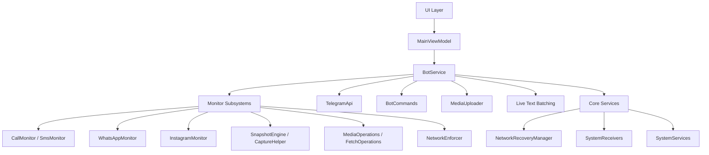

<h1 align="center">
  System Architecture
</h1>

<p align="center">
  <strong>Internal Mechanics, Component Structure & Integrations</strong>
</p>

---

> [!NOTE]
> This document provides a comprehensive overview of the internal mechanisms, component structure, and architectural patterns implemented within the Superior Monitor system.

---

## 1. High-Level Architecture



---

## 2. Core Directory Structure

```
app/src/main/java/com/system/superiormonitor/
├── bot/                        # Telegram C2 orchestration layer
│   ├── BotService.kt           # Central foreground service & live text batching
│   ├── BotCommands.kt          # Command parser & routing
│   ├── BotActions.kt           # Remote side-effects & device control
│   ├── OfflineManager.kt       # Offline queue & categorical sync pipeline
│   ├── MediaUploader.kt        # Universal media upload API with offline fallback
│   ├── BotMessages.kt          # Unified text strings & templates
│   ├── BotMarkups.kt           # Telegram Inline Keyboards via type-safe DSL
│   └── TelegramApi.kt          # Networking singleton
├── core/                       # Platform integration & system services
│   ├── CaptureHelper.kt        # Unified root capture engine (screencap & camera)
│   ├── Diagnostics.kt          # LogManager & TelemetryCollector
│   ├── NetworkRecoveryManager.kt # Connectivity monitoring & recovery sequencing
│   ├── NotificationListener.kt # Advanced notification interception, media parsing & filtering
│   ├── SystemManager.kt        # OS permission checks & launcher visibility
│   ├── SystemReceivers.kt      # Broadcast receivers (Boot, Dialer, DeviceAdmin, AppInstall)
│   ├── SystemServices.kt       # AccessibilityService (Keyevent)
│   └── UtilityActivities.kt    # BatchManager, ZipManager, PopupActivity & CamouflageActivity
├── monitor/                    # Background data extraction & subsystems
│   ├── CallMonitor.kt          # Telephony event interception
│   ├── SmsMonitor.kt           # SMS interception (incoming + outgoing)
│   ├── WhatsAppMonitor.kt      # Root-level database extraction (Normal & Business variants)
│   ├── InstagramMonitor.kt     # Root-level Instagram DM extraction
│   ├── KeyEvents.kt            # Key events scheduler via AlarmManager
│   ├── MediaOperations.kt      # On-demand media captures & mic recording
│   ├── FetchOperations.kt      # On-demand retrieval of contacts & call logs
│   ├── SnapshotEngine.kt       # Scheduled snapshots & SnapshotScheduler
│   └── NetworkEnforcer.kt      # Persistent Wi-Fi/Data/Hotspot enforcement
├── ui/                         # Jetpack Compose presentation layer
│   ├── AppScreen.kt            # Navigation scaffold & drawer
│   ├── DashboardScreen.kt      # Main dashboard with feature toggles
│   ├── PermissionsScreen.kt    # Centralized permission management
│   ├── SettingsScreen.kt       # Bot credentials & launcher visibility
│   ├── BCRSettingsScreen.kt    # Call recorder configuration
│   ├── LogsScreen.kt           # Real-time log viewer
│   ├── Components.kt           # Reusable UI components
│   └── MainViewModel.kt        # MVVM ViewModel & StateFlow management
├── data/                       # Persistence & models
│   ├── PrefsManager.kt         # SharedPreferences with Kotlin delegates
│   └── TelegramModels.kt       # Telegram API data classes
├── theme/                      # Design system
│   └── Theme.kt                # Material 3 color tokens & typography
├── MainActivity.kt             # Entry point & Compose host
└── SuperiorMonitorApp.kt       # Application class
```

---

## 3. Component Details

### 3.1. `bot/` — Telegram Orchestration Layer

Handles all real-time communication between the device and the Telegram Bot API.

| File | Responsibility |
|:---|:---|
| **`BotService.kt`** | **The Lifecycle Manager** — Foreground service managing the Telegram polling loop and monitor initialization. Delegates all debounce and queueing to `BatchManager`. Uses a generic `handleMonitorToggle()` function and a Kotlin `when` tree for `onStartCommand` intent routing (e.g. instantly delegating snapshot intents to `SnapshotWorker` to prevent ANRs). |
| **`BotCommands.kt`** | **The Router** — Parses raw Telegram updates and routes commands/callbacks. Silently drops non-command media to keep the chat clean. Fully decoupled from string building. |
| **`BotActions.kt`** | **The Controller** — Single source of truth for actions and side-effects. Centralizes authorization/security (`handleUnauthorizedAccess()`), remote popups, and device control. |
| **`OfflineManager.kt`**| **The Synchronization Engine** — Path-based categorical sync pipeline handling text logs, offline media discovery (`whatsapp/offline/media`), and rate-limit safe sequential syncing for audio. Evaluates media queues and intelligently groups files into Albums or ZIPs via `ZipManager`. |
| **`MediaUploader.kt`** | **The Upload Gateway** — Universal API for `uploadDocument`, `uploadDocumentUri`, `uploadPhoto`, and `uploadMediaGroup` requests. Automatically routes failed media to `OfflineManager` using robust cross-mount `copyTo` fallback. Also handles legacy intent-based uploads. |
| **`BotMessages.kt`** | **The View / Text Dictionary** — Single source of truth for all text. Uses `buildMenuHeader()`, `buildBulkUploadMessage()` (dynamic direction formatting), and `buildOfflineSyncCaption()`. Includes custom formatting for native Album headers. |
| **`BotMarkups.kt`** | **The View / UI Structure** — Single source of truth for all Telegram Inline Keyboards. Uses a type-safe `inlineKeyboard { row { button() } }` Kotlin DSL built on `org.json.JSONObject` to guarantee JSON syntax validity. |
| **`TelegramApi.kt`** | **Networking Singleton** — Uses `OkHttpClient` for all Telegram API requests. Contains API reachability validation, `escapeMarkdown()` for safe string interpolation, and file upload logic. |

---

### 3.2. `core/` — Platform Integration & System Services

Infrastructure layer providing OS-level hooks, diagnostics, broadcast handling, and shared capture logic.

| File | Responsibility |
|:---|:---|
| **`CaptureHelper.kt`** | **Root Capture Engine** — Unified execution layer for root-based screencap (`screencap -p`) and camera captures (`CameraManager`). Extracted from formerly duplicated logic in `MediaOperations.kt` and `SnapshotEngine.kt`. Enforces lock screen rules: on-demand screenshots and scheduled captures fail on locked screens; on-demand cameras bypass the lock screen. |
| **`Diagnostics.kt`** | **Logging & Telemetry** — Contains `LogManager` (centralized logging utility using `StateFlow` to push categorized real-time logs to the Compose UI, with automatic error mirroring) and `TelemetryCollector` (gathers live system metrics asynchronously: CPU frequency, thermal zones, cellular signal strength, battery, storage, and carrier info via root commands). |
| **`NetworkRecoveryManager.kt`** | **Network Recovery** — Monitors connectivity via `ConnectivityManager.NetworkCallback`. Upon network restoration, waits 5 seconds for DNS/socket stabilization, validates Telegram API health, sends a connection-restored notification with telemetry, and triggers the full offline queue sync pipeline. |
| **`NotificationListener.kt`**| **Notification Interceptor** — Native `MonitorNotificationListenerService`. Features Memory-Safe Image Extraction (`EXTRA_PICTURE`), `MessagingStyle` array parsing for perfect chat logs, and Dynamic Bot Blacklist via `ForceReply` filtering. |
| **`SystemManager.kt`** | **OS Permissions & Launcher** — Encapsulates all permission state queries (root, Device Admin, Accessibility, Notification Listener, camera, SMS, contacts, etc.) and controls launcher icon visibility with camouflage activity fallback. |
| **`SystemReceivers.kt`** | **Broadcast Receivers** — Contains `BootReceiver`, `DialerCodeReceiver`, `MonitorDeviceAdminReceiver`, and `AppInstallReceiver` (uses background Coroutines for IPC package resolution to prevent main-thread ANRs). |
| **`SystemServices.kt`** | **Accessibility** — Contains `MonitorAccessibilityService` (key event interception via `AccessibilityEvent`, batches keystrokes per-app and flushes to offline files via asynchronous background Coroutines to prevent UI stutters). |
| **`UtilityActivities.kt`** | **Utility & Core Managers** — Contains `BatchManager` (centralized concurrent queue engine with Mutex locks), `ZipManager` (unified archival and MIME-type categorization for offline media), `PopupActivity`, and `CamouflageActivity`. |

---

### 3.3. `monitor/` — Background Data Extraction

Responsible for gathering telemetry, media, and intercepting device events. All monitors establish a fresh baseline ID on startup and only process new events.

| File | Responsibility |
|:---|:---|
| **`CallMonitor.kt`** | Hooks into the Android Telephony framework to capture call events. Uses `OfflineManager.sendOrQueue()` for offline resilience and `BotMessages` for strings. |
| **`SmsMonitor.kt`** | Monitors incoming/outgoing SMS traffic. Captures messages with debounce + mutex locking, delegating offline handling to `OfflineManager`. |
| **`WhatsAppMonitor.kt`** | Uses root (`su`) to poll `msgstore.db` (and `wa.db`). Features dynamic path resolution for media extraction. Uses `context.filesDir` as workspace to bypass FUSE. Includes robust fallback to `OPEN_READONLY` SQLite access if root `666` permissions fail. Supports both modern and legacy SQL schemas. |
| **`InstagramMonitor.kt`** | Polls `direct.db` via `stat` (standard SQLite), dynamically handles JSON BLOB parsing, extracts usernames, deduplicates via timestamp baselining, and routes to offline queues. Uses `context.filesDir` workspace and `chown` for WAL recovery, matching WhatsApp's bypass pattern. |
| **`KeyEvents.kt`** | Orchestrates scheduled Key Events uploads using `AlarmManager` with automatic fallback to inexact alarms. |
| **`MediaOperations.kt`** | Handles on-demand media captures (screenshot, front/rear camera) and duration-based mic recordings. Delegates root capture execution to `CaptureHelper`. Uses `MediaUploader` for all uploads with robust offline routing. |
| **`FetchOperations.kt`** | Handles on-demand asynchronous retrieval of device contacts and full call activity history. Generates flat-file backups and queues to `OfflineManager` via `MediaUploader` if disconnected. |
| **`SnapshotEngine.kt`** | Orchestrates scheduled snapshots using `AlarmManager`. Contains `SnapshotScheduler`. Delegates root capture execution to `SnapshotWorker` (via `BotService` routing) running in background IO coroutines to completely eliminate 10-second ANR limits. |
| **`NetworkEnforcer.kt`** | Persistent network enforcement module. Evaluates connectivity state on boot and monitors for changes. Re-enables Wi-Fi, Mobile Data, or Hotspot via root commands and Java Proxy Reflection into `TetheringManager`. Includes built-in fail-safes that auto-disable failing toggles. |

> [!WARNING]
> **Experimental Feature**: The `NetworkEnforcer` heavily manipulates restricted internal Android APIs (e.g., dynamic proxy generation for `TetheringManager` callbacks). This feature was engineered and verified on a Realme device running Android 11. Due to OEM customizations and varying Android versions, this capability **may not work universally** and could cause unexpected behavior, system UI crashes, or soft reboots. The enforcer includes automatic fail-safe logic to disable problematic toggles on boot failure.

---

### 3.4. `ui/` — Jetpack Compose Presentation Layer

Provides a modern, visually cohesive UI using Jetpack Compose and Material 3.

| File | Responsibility |
|:---|:---|
| **`AppScreen.kt`** | The main navigation scaffold with a custom `ModalNavigationDrawer`, persistent top bar, and animated screen transitions between all pages. |
| **`DashboardScreen.kt`** | The primary dashboard displaying all feature toggles: Service Status, Persistent Enforcement (collapsible), Security Snapshots, Basic Updates, and Social Updates. Uses `SuperiorWarningDialog` from `Components.kt` for all warnings. |
| **`PermissionsScreen.kt`** | Centralized permission management UI. Features an interactive, on-demand Root Access button that safely requests and displays root status without freezing the app on startup. |
| **`SettingsScreen.kt`** | Bot credential configuration (Token & Chat ID), launcher visibility toggle with confirmation dialogs, system checks, and About section. |
| **`BCRSettingsScreen.kt`** | Call recorder settings: audio source, encoding format, sampling rate, bitrate, and recording behavior configuration. |
| **`LogsScreen.kt`** | Real-time log viewer powered by `LogManager`'s `StateFlow`, with log clearing functionality and category-based display. |
| **`Components.kt`** | Reusable UI components: `OuterCard`, `InnerListHost`, `TactileSwitch`, `SectionTitle`, `SuperiorWarningDialog`, and other styled building blocks. |
| **`MainViewModel.kt`** | MVVM ViewModel managing all UI state via `StateFlow`. Handles permission checks, feature toggle persistence, service lifecycle coordination, and implements secure Root Persistence caching to survive Android memory kills. Uses unified `currentWarningTitle`/`currentWarningMessage` state for dialog management. |

---

### 3.5. `data/` — Persistence & Models

| File | Responsibility |
|:---|:---|
| **`PrefsManager.kt`** | Centralized `SharedPreferences` manager using Kotlin property delegates. Pre-warmed asynchronously in the Application class (`SuperiorMonitorApp.kt`) to bypass initial Main Thread Keystore decryption penalties and eliminate ANRs. |
| **`TelegramModels.kt`** | Kotlin data classes representing the Telegram Bot API schema (`UpdateResponse`, `Message`, `CallbackQuery`, etc.). |

---

### 3.6. `theme/` — Design System

| File | Responsibility |
|:---|:---|
| **`Theme.kt`** | Defines the complete Material 3 design system: custom color tokens (dark theme), typography scales, and the `SuperiorMonitorTheme` composable wrapper. |

---

## 4. Live Text & Media Batching Mechanism

All real-time telemetry (text, notifications, and media bursts) is routed through unified, centralized queueing systems in `UtilityActivities.kt` before being dispatched to Telegram. This guarantees strict DRY compliance and thread-safe serial uploads.

| Component | Role |
|:---|:---|
| **`BatchManager`** | The central concurrent queue engine. Uses Coroutines, `ConcurrentHashMap`, and `Mutex` locks to debounce text/notifications (3-second window) and media (8-second window) across all live monitors. |
| **`ZipManager`** | Unified compression engine. Intelligently sorts both live media bursts and offline accumulations by precise MIME type (Images, Videos, Audio, Documents) to prevent Telegram API grouping crashes. Contains `Mutex` locks to safely serialize directory access. |

### Batching & Categorization Logic

1. **Text & Notifications**: A 3-second debounce window groups rapid text events.
   - **1–2 messages**: Sent individually, preserving `parseMode` markdown.
   - **3+ messages**: Compiled into a `.txt` bulk document (e.g., `📦 Live Batch Upload`) and sent as a single file.
2. **Media Extraction (WhatsApp/Instagram)**: An 8-second debounce window natively batches media bursts.
   - Files are pre-sorted categorically (Images, Videos, Audio, Documents).
   - **2-3 visual files**: Uploaded seamlessly as a native Telegram Album (`MediaGroup`) containing perfect header context inherited from the first message.
   - **>3 visual files (or any large documents)**: Compressed into dedicated ZIP archives via `ZipManager`.
3. **Mutex Serialization**: `BatchManager` guarantees that live sweeps never overlap with `OfflineManager` periodic syncs, totally eliminating race conditions and duplicate uploads.

---

## 5. Basic Call Recorder (BCR) Integration

The core call recording engine is integrated directly from the open-source [Basic Call Recorder (BCR)](https://github.com/chenxiaolong/BCR) repository.

> **Credits**: A huge thanks to [chenxiaolong](https://github.com/chenxiaolong) for developing the original BCR project, which provides the robust native call recording foundation used here.

- **Workflow**: When a call is recorded, BCR generates the `.opus`/`.m4a` file. Superior Monitor intercepts this via a direct custom patch in BCR's `OutputDirUtils.kt`, which triggers `BotService` via an explicit foreground service intent (`ACTION_UPLOAD_RECORDING`). `MediaUploader.handleUploadRecording()` then uploads the recording to Telegram. If the network is unreachable, the recording stays in its offline directory for the next sync cycle.

---

## 6. Advanced Fallback & Offline Queue Mechanics

Superior Monitor handles intermittent network connectivity gracefully through a multi-phase strategy:

| Phase | Strategy |
|:---|:---|
| **Detection** | `NetworkRecoveryManager` uses `ConnectivityManager.NetworkCallback` to detect outages. |
| **Live Batching** | Text notifications are debounced for 3 seconds, then sent individually or bundled into `.txt` documents. |
| **Queuing** | Media goes to `offline/` hierarchy; text logs append to persistent files via `queueOnlyInternal()`. |
| **Recovery** | Waits exactly 5s for DNS/Socket stabilization. Intercepts API failures in real-time to prevent data loss. |
| **Trickle-Sync** | Sequential uploads with rate-limit mitigation (`HTTP 429`). |

### Recovery Sequence

1. **Detection**: `NetworkRecoveryManager` actively monitors network state via `ConnectivityManager.NetworkCallback`. When offline, the polling loop enters deep sleep.
2. **Offline Queuing**:
   - Media (snapshots, camera shots) are routed to a structured `captures/{screen,front,rear}/[date]/offline/` folder hierarchy.
   - Text logs (calls, SMS, WhatsApp, Instagram) are appended to persistent text files (e.g., `offline_calls.txt`).
   - Fetch Backups (contacts, call activity) are saved as individual flat files in their respective `offline/` folders.
   - Call recordings (BCR) are retained in their offline directories.
   - **API Failure Interception**: If the device is online but the API rejects the message (ISP block/DNS failure), the boolean failure is intercepted and routed directly to offline queues.
3. **Recovery Sequence**: Upon network restoration, `NetworkRecoveryManager` waits exactly 5 seconds for DNS and sockets to stabilize, validates Telegram API health, sends a connection-restored notification with telemetry, and initiates a trickle-sync.
4. **Trickle-Sync Strategy**:
   - **Text & Data Logs**: Lightweight files (SMS, calls, WhatsApp, Instagram, and Fetch backups) are uploaded sequentially with a 2-second delay and immediately deleted upon success.
   - **Sequential Audio**: Heavy files (Call recordings, MediaOps) are strictly decoupled from batching and uploaded sequentially with a 2-second delay to respect Telegram rate limits (`HTTP 429`).
   - **Batched Snapshots**: Automated evaluation detects if > 3 snapshots exist in the queue. If so, they are natively compressed into a ZIP archive for bulk upload.
   - **Zero-Loss Retention**: If any upload fails, the local cache safely retains the file in the `offline` directory for the next attempt.

---

<p align="center">
  <sub>Built with ❤️ by <a href="https://gitlab.com/sandeshsahu">@sandeshsahu</a></sub>
</p>