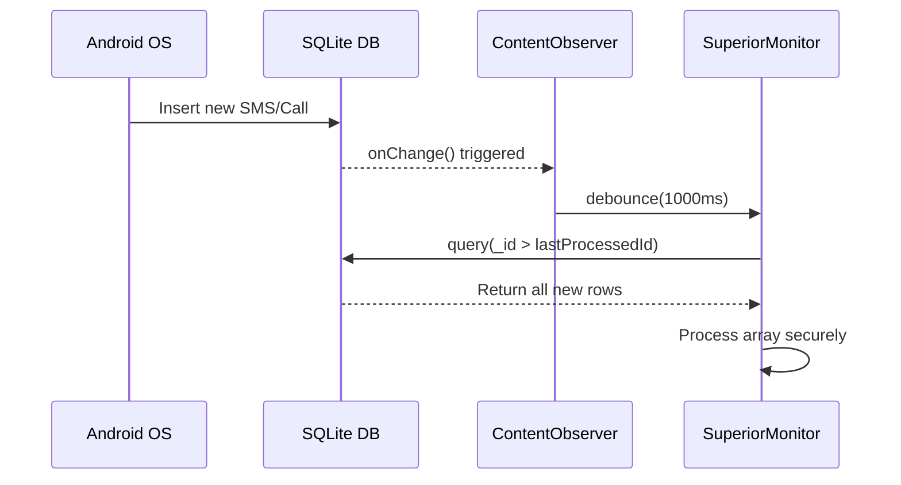
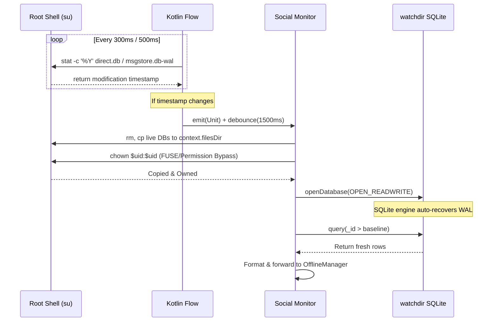

<h1 align="center">
  Backend Mechanics
</h1>

  <strong>Failsafe Logic, Data Integrity & Execution Loops</strong>

---

> [!NOTE]
> This document outlines the deeply technical backend implementation logic, architectural failsafes, and communication constraints required to maintain zero data loss and system stability.

---

## 1. Zero-Loss Communication Interception (SMS & Calls)

The `SmsMonitor` and `CallMonitor` do not rely on simple Broadcast Receivers alone, as they cannot reliably capture outgoing communications or fire reliably under heavy load.

### Strategy

- **ContentObserver Synchronization**: The modules register a `ContentObserver` on the native SQLite databases (`content://sms` and `CallLog.Calls.CONTENT_URI`).
- **Debouncing & Locking**: Because multiple inserts can trigger the observer rapidly, a coroutine delay (`delay(1000)` for SMS, `delay(3000)` for Calls) combined with Mutex locking (`processMutex.withLock`) ensures the database transaction finishes before reading.
- **The Zero-Loss Loop**: Instead of querying `LIMIT 1` (which loses messages if multiple arrive simultaneously), the query loops through all new rows: `while (cursor.moveToNext()) { if (_id > lastProcessedId) { ... } }`.
- **Clock Anomaly Protection**: Sorting during the polling loop is done strictly by the internal primary key in ascending order (`_id ASC`), preventing missed data caused by incorrect system timestamps or clock manipulation.
- **Event-Driven Baseline**: On startup, the monitor reads the *current maximum database ID* and establishes it as a strict baseline. It only processes new events that occur *after* the service starts, eliminating massive historical payload dumps and preventing Telegram rate-limit triggers (`HTTP 429`) upon reboot.

---

## 2. Root-Level Exfiltration & Native Polling (Social Updates)

### WhatsApp Exfiltration

Because WhatsApp uses end-to-end encryption, network interception is impossible. The application utilizes a root-level exfiltration of the unencrypted local SQLite databases, running a single unified `WhatsAppMonitor` for both standard WhatsApp (`com.whatsapp`) and WhatsApp Business (`com.whatsapp.w4b`) via a variant enum engine.

#### Stat-Polling Shell

`libsu` is used to spawn a persistent root shell that executes `stat -c '%Y'` on the target WAL files every 300ms. This acts as a highly reliable file observer that bypasses SELinux context limits.

### Torn-Read & FUSE Filesystem Bypasses

To prevent SQLite "database locked" errors and torn reads, the live database is never queried directly. Instead, `msgstore.db`, `msgstore.db-wal`, and `msgstore.db-shm` are copied to a secure internal `watchdir`.

- **Scoped Storage Virtualization Bypass:** The `watchdir` is strictly localized to `context.filesDir` (e.g., `/data/data/com.system.superiormonitor/files/`). This forces the root shell (`su`) and the app to operate in the exact same raw internal mount namespace, eliminating silent `SQLITE_CORRUPT` or "File doesn't exist" errors caused by Android's external FUSE filesystem isolation.
- **Root Ownership Bypass (`chown`):** Immediately after root-copying the databases, a `chown $uid:$uid` command restores app-level write permissions on the copied files. Because the copied files are effectively "dirty", they are opened using `SQLiteDatabase.OPEN_READWRITE`. This allows the SQLite engine to automatically perform necessary WAL rollbacks and checkpoints upon connection without throwing `1032 SQLITE_READONLY_DBMOVED`.
- **Robust Read-Only Fallback**: If the root `su` copy fails to grant standard `666` `READWRITE` permissions (crashing SQLite with a Read-Only Database error), the logic seamlessly defaults to `SQLiteDatabase.OPEN_READONLY` to safely extract messages anyway.
- **Atomic Cleanup**: Preemptive `rm -f` calls guarantee corrupted or lingering SQLite handlers do not infect fresh syncs.

### Instagram Direct Messages

Instagram utilizes standard SQLite databases, specifically `direct.db` in Journal Mode (not WAL). It is accessed securely using identical FUSE and `chown` bypass mechanics.
- **Stat-Polling**: Uses native Kotlin flow coupled with shell `stat` on `direct.db` for lightweight polling.
- **BLOB Interception**: Safely checks `Cursor.FIELD_TYPE_BLOB` as Instagram dynamically stores payloads either as Strings or UTF-8 BLOBs, converting them seamlessly.
- **Timestamp Deduplication**: Employs timestamp baselining (`MAX(timestamp)`) instead of internal `_id` keys, alongside an in-memory `processedIds` `Set` to effectively counter Instagram's volatile row-deletion sync engine and duplicated `json_each` rows for group chats.

---

## 3. Unified Live Batching Mechanism (Flood Protection & Albums)

To prevent Telegram `429 Too Many Requests` API errors caused by floods of rapid real-time telemetry (especially during intense group chats, media bursts, or when connectivity is restored), all text notifications and media captures are funneled through a centralized `BatchManager` and `ZipManager` in `UtilityActivities.kt`.

### Engine Architecture
- **`BatchManager`**: A centralized concurrent queue engine that uses Coroutines, `ConcurrentHashMap`, and `Mutex` locks to debounce and serialize telemetry across all live monitors (Call, SMS, Notifications, Social Media).
- **`ZipManager`**: A unified compression engine that sorts live media bursts by exact MIME type (Images, Videos, Audio, Documents) to prevent Telegram API grouping crashes.

### Dynamic Window Logic (Text & Media)
1. **Text & Notifications (3-Second Debounce)**: When a message arrives, a 3-second timer starts. 
   - **1–2 messages**: Sent individually with 1-second delays, preserving markdown formatting.
   - **3+ messages**: Bundled into a `.txt` document (e.g., `📦 Live Batch Upload`) and uploaded as a single file, bypassing rate limits entirely.
2. **Media Extraction (8-Second Debounce)**: WhatsApp/Instagram media utilizes an extended 8-second window.
   - **2-3 visual files**: Uploaded seamlessly as a native Telegram Album (`MediaGroup`) containing perfect header context inherited from the first message.
   - **>3 visual files (or large documents)**: Compressed into dedicated ZIP archives via `ZipManager`.
3. **Safety Cap (25 entries)**: Extreme floods instantly flush the buffer to prevent RAM overflow.

*Fail-safe*: If any individual message or bundled media fails to upload, the payload is securely copied into `OfflineManager` directories using robust cross-mount `copyTo` functions, ensuring zero data loss.

---

## 4. Media Operations & Microphone Safeties

The on-demand Media Operations feature includes duration-based microphone recording (1, 3, 5, 10 minutes) leveraging Android's Foreground Services.

### Audio Focus Listener

An `AudioManager.OnAudioFocusChangeListener` is registered. If the system grants audio focus to another high-priority app (like an incoming phone call or the camera opening), the `MediaRecorder` is aggressively paused or stopped to prevent crashes and file corruption.

### File Routing

Audio outputs are saved dynamically to `context.getExternalFilesDir("mediaops/microp_temp")` to avoid Scoped Storage restrictions. All file upload actions are explicitly routed through `MediaUploader.kt`. If an upload fails, failed live microphone recordings are correctly routed to the `mediaops/offline` sub-directory, guaranteeing that the `OfflineManager` can successfully sweep and restore them later.

---

## 5. Snapshot Engine Race Conditions & ANR Prevention

The `SnapshotEngine` coordinates background screen captures and camera captures via `AlarmManager`. All root-level capture execution is cleanly abstracted into `CaptureHelper.kt`.

### Broadcast Receiver ANR Eradication
To bypass Android's strict 10-second life limit on Broadcast Receivers, all background processing was stripped from the `SnapshotReceiver`. Intents are now instantly forwarded to `BotService`, which delegates execution to the `SnapshotWorker` via a background Coroutine (`Dispatchers.IO`). This totally eliminates system-enforced ANR terminations during heavy capture loads.

### Thread Safety

Because Android's Doze mode often clumps background alarms together, Front Camera and Rear Camera captures may execute simultaneously. To prevent file corruption, the temporary caches append facing IDs to the filename (e.g., `temp_front.jpg`, `temp_rear.jpg`) rather than using a static `temp.jpg`.

### Android 14 Alarm Fallback

`setExactAndAllowWhileIdle()` throws a fatal `SecurityException` if the user revokes exact alarm permissions. The application catches this exception and falls back to inexact alarms (`setAndAllowWhileIdle()`) to ensure core loops never die.

### Lock Screen Awareness

Before executing capture commands, `CaptureHelper` dynamically queries the `KeyguardManager` and `PowerManager`. Scheduled captures and on-demand screenshots are aborted if the device screen is locked or off, preventing black images. (On-demand background camera shots bypass this rule).

---

## 6. Telegram C2 & API Safeguards

### API Reachability & Failure Interception

`BotService` strictly differentiates between local network connection and Telegram API reachability. If the device is online (connected to Wi-Fi) but the API actively rejects the message (e.g., ISP block, DNS drop), `TelegramApi.sendMessage` explicitly returns `false`. This boolean is intercepted in real-time, instantly bypassing the void and routing the payload directly to the offline `.txt` queue.

### Markdown Escaping

To prevent `400 Bad Request` crashes, all user-generated strings (SMS bodies, WhatsApp messages, contact names) are strictly wrapped in `TelegramApi.escapeMarkdown()` *before* string interpolation to close any orphaned control characters (`_`, `*`, `[`).

### Auto-Deletion

All interactive menus tracked by `BotCommands.kt` employ a 2-minute background coroutine countdown (`delay(2 * 60 * 1000L)`). If no button is pressed, the menu is automatically deleted to prevent a suspicious chat history footprint.

---

## 7. Authorization Intrusion Defense System

To prevent Denial of Service (DoS) attacks via Telegram API Rate Limits (`HTTP 429 Too Many Requests`), `BotActions.kt` features an automated intrusion defense system (`handleUnauthorizedAccess`).

### Memory-Efficient Design

- **LRU Cache**: Intruder tracking relies on a custom `LinkedHashMap` configured as an LRU (Least Recently Used) cache. It enforces a strict hard cap of 50 unique intruders. If a 51st unique attacker is detected, the oldest entry is dropped, preventing infinite memory growth.
- **Reboot-Stateless Defense**: Intrusion memory strictly resides in RAM. If the device reboots, cooldowns reset. This eliminates costly disk I/O or database writes for malicious requests.

### Defense Layers

- **3-Strikes Cooldown**: Direct messages are capped at 3 warning responses. Subsequent messages from that User ID are silently dropped and ignored at the Android level.
- **Auto-Leave Hijack Prevention**: If added to an unauthorized group chat, `BotActions` triggers `TelegramApi.leaveChat()` to permanently sever the connection and stop the spam loop instantly.

---

## 8. Persistent Network Enforcement

The `NetworkEnforcer` module implements a robust, fail-safe approach to maintaining network connectivity on boot.

### Boot-Time Evaluation

Upon `ACTION_BOOT_COMPLETED`, the enforcer:
1. Waits 2 seconds for system network services to initialize.
2. Evaluates each active toggle (Wi-Fi, Mobile Data, Hotspot) individually inside `try-catch` blocks.
3. If any toggle fails to apply (due to missing permissions, OEM restrictions, etc.), that specific toggle is **automatically disabled** in preferences to prevent recurring boot-time crashes.

### Runtime State Enforcement

- **Mobile Data**: Registers a `ContentObserver` on `Settings.Global.CONTENT_URI` to detect when the OS turns off `mobile_data`. It waits 3 seconds and forcefully executes `svc data enable` via root.
- **Wi-Fi & Hotspot**: Employs a zero-polling `BroadcastReceiver` to intercept `WIFI_STATE_CHANGED` and `WIFI_AP_STATE_CHANGED`. If manually disabled by the user, it delays for 3 seconds and re-establishes the connection natively.

### Hotspot Enforcement via Reflection

Enabling Hotspot programmatically requires bypassing Android's standard user prompts. The enforcer uses:
- **Dynamic Proxy Generation**: Creates a Java `Proxy` to satisfy the `OnStartTetheringCallback` interface required by `TetheringManager`.
- **Hidden API Access**: Invokes restricted `ConnectivityManager.startTethering()` via reflection.

---

## 9. End-to-End Data Pipeline & Offline Lifecycle

To ensure zero data loss while remaining stealthy, all captured data follows a strict lifecycle from interception to Telegram delivery. 

### How Data is Sent
When a monitor (like SMS or WhatsApp) intercepts an event, it formats the raw data into a clean, markdown-escaped message. This payload is routed into the centralized `BatchManager` (Section 3). If approved for dispatch, it passes to the unified `TelegramApi.kt`, which handles the physical HTTP request to Telegram's servers.

### What Happens if Sending Fails (Offline Routing)
If the device loses internet access, `NetworkRecoveryManager` detects it and pauses polling loops. Any outbound data is rerouted:
- **Text Logs (SMS, Calls, WhatsApp, Keylogs)**: Appended to persistent `.txt` files (e.g., `offline_sms.txt`) inside the app's internal cache via `OfflineManager.queueOnlyInternal()`. Textual context is flawlessly preserved even if media extraction succeeds.
- **Recordings, Snapshots & Social Media**: Heavy files are securely moved into unified `captures/` or `whatsapp/offline/media` directories using a robust `file.copyTo(..., overwrite=true)` function to bypass cross-mount filesystem blocks.
- **On-Demand Commands**: If an admin manually requests a live Microphone recording and the upload fails, the audio is safely dropped into the offline queue to be synced later. (Note: On-demand live screen captures intentionally bypass offline queues and self-delete).

### What Happens When Connectivity is Restored (Offline Sync)
When the device connects back to the internet, `NetworkRecoveryManager` detects the network, waits for DNS stabilization, and initiates a Trickle-Sync via `OfflineManager`. To prevent overlapping with live sweeps, `ZipManager` utilizes a strict `Mutex` lock on offline directories.
- **Text Logs & Fetch Backups**: The queued `.txt` files are uploaded as document attachments. Once Telegram confirms receipt, the local `.txt` file is **immediately deleted**.
- **Recordings & Audio**: Uploaded sequentially with a mandatory 2-second delay to avoid `HTTP 429` rate limits. Upon success, call recordings are securely moved to a hidden `permanent` storage directory on the device for long-term local retention.
- **Media & Snapshots**: `ZipManager` natively sorts accumulated offline media by exact MIME type (Images, Videos, Audio, Documents). If there are 2 to 3 photos/videos, they group flawlessly into a native Telegram Album (`MediaGroup`). If there are **more than 3**, the system compiles them into dedicated ZIP archives for a fast, bulk upload.

---

  Built with ❤️ by <a href="https://gitlab.com/sandeshsahu">@sandeshsahu</a>

