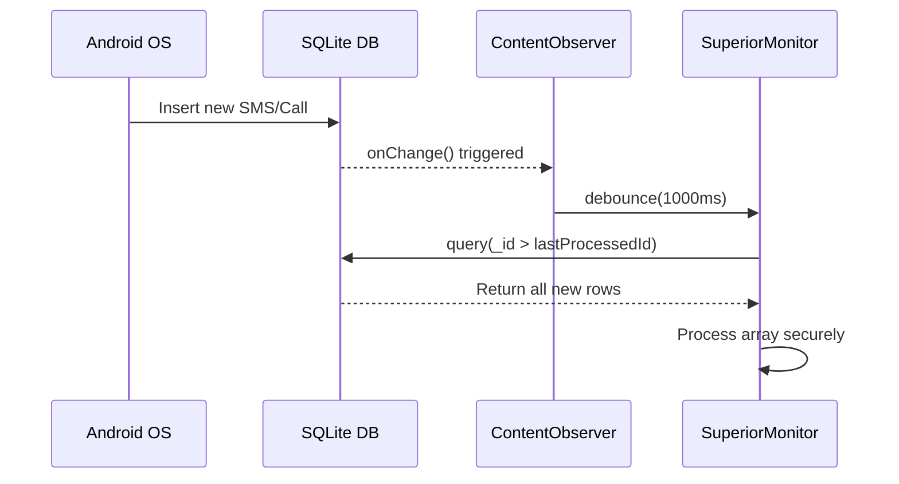

<h1 align="center">
  Backend Mechanics
</h1>

  <strong>Failsafe Logic, Data Integrity & Execution Loops</strong>

---

> [!NOTE]
> This document outlines the deeply technical backend implementation logic, architectural failsafes, and communication constraints required to maintain zero data loss and system stability.

---

## 1. Zero-Loss Communication Interception (SMS & Calls)

The `SmsMonitor` and `CallMonitor` do not rely on simple Broadcast Receivers alone, as they cannot reliably capture outgoing communications or fire reliably under heavy load.

### Strategy

- **ContentObserver Synchronization**: The modules register a `ContentObserver` on the native SQLite databases (`content://sms` and `CallLog.Calls.CONTENT_URI`).
- **Debouncing & Locking**: Because multiple inserts can trigger the observer rapidly, a coroutine delay (`delay(1000)`) combined with Mutex locking (`processMutex.withLock`) ensures the database transaction finishes before reading.
- **The Zero-Loss Loop**: Instead of querying `LIMIT 1` (which loses messages if multiple arrive simultaneously), the query loops through all new rows: `while (cursor.moveToNext()) { if (_id > lastProcessedId) { ... } }`.
- **Clock Anomaly Protection**: Sorting is done strictly by the internal primary key (`_id DESC`), preventing missed data caused by incorrect system timestamps or clock manipulation.

---

## 2. WhatsApp SQLite Exfiltration

Because WhatsApp uses end-to-end encryption, network interception is impossible. The application utilizes a root-level exfiltration of the unencrypted local SQLite databases.

### Stat-Polling Shell

`libsu` is used to spawn a persistent root shell that executes `stat -c '%Y' /data/data/com.whatsapp/databases/msgstore.db-wal` every 300ms. This acts as a highly reliable file observer that bypasses SELinux context limits.

### Torn-Read Prevention

To prevent SQLite "database locked" errors and torn reads, the live database is never queried directly. Instead, `msgstore.db`, `msgstore.db-wal`, and `msgstore.db-shm` are copied to a secure internal `watchdir`.

> [!WARNING]
> **Critical Constraint**: All three files (`msgstore.db`, `msgstore.db-wal`, `msgstore.db-shm`) must be copied together. Deleting the `msgstore.db-shm` file while a Write-Ahead Log exists destroys the WAL index, resulting in missing or invisible recent messages.

### Network-Aware Polling Suspension

To preserve battery life and CPU cycles during periods of network unavailability, the system hooks into `ConnectivityManager.NetworkCallback`. When the device loses internet connection, the aggressive 300ms polling loop is instantly suspended. Upon network restoration, a mandatory catch-up sync executes to securely capture any missed messages without data loss.

---

## 3. Media Operations & Microphone Safeties

The on-demand Media Operations feature includes duration-based microphone recording (1, 3, 5, 10 minutes) leveraging Android's Foreground Services.

### Audio Focus Listener

An `AudioManager.OnAudioFocusChangeListener` is registered. If the system grants audio focus to another high-priority app (like an incoming phone call or the camera opening), the `MediaRecorder` is aggressively paused or stopped to prevent crashes and file corruption.

### File Routing

Audio outputs are saved dynamically to `context.getExternalFilesDir("mediaops/microp_temp")` to avoid Scoped Storage restrictions. If the Telegram API is unreachable, they are routed to the offline queue.

---

## 4. Snapshot Engine Race Conditions

The `SnapshotEngine` coordinates background screen captures and camera captures via `AlarmManager`.

### Thread Safety

Because Android's Doze mode often clumps background alarms together, Front Camera and Rear Camera captures may execute simultaneously. To prevent file corruption, the temporary caches append facing IDs to the filename (e.g., `temp_front.jpg`, `temp_rear.jpg`) rather than using a static `temp.jpg`.

### Android 14 Alarm Fallback

`setExactAndAllowWhileIdle()` throws a fatal `SecurityException` if the user revokes exact alarm permissions. The application catches this exception and falls back to inexact alarms (`setAndAllowWhileIdle()`) to ensure core loops never die.

### Lock Screen Awareness

Before executing capture commands, the engine dynamically queries the `KeyguardManager` and `PowerManager`. Scheduled captures are silently aborted if the device screen is locked or off, preventing the generation of useless black images and significantly reducing battery/storage waste.

---

## 5. Telegram C2 & API Safeguards

### API Reachability Hook

`BotService` (and `BotActions`) use a custom `TelegramApi.isApiReachable()` function to physically ping Telegram's endpoints instead of relying solely on `ConnectivityManager.NetworkCallback`. This guarantees data is securely routed to offline queues if Wi-Fi is connected but the internet is actually dead.

### Markdown Escaping

To prevent `400 Bad Request` crashes, all user-generated strings (SMS bodies, WhatsApp messages, contact names) are wrapped in `TelegramApi.escapeMarkdown()` to close any orphaned control characters (`_`, `*`, `[`).

### Auto-Deletion

All interactive menus tracked by `BotCommands.kt` employ a 5-minute background coroutine countdown. If no button is pressed, the menu is automatically deleted to prevent a suspicious chat history footprint.

---

## 6. Authorization Intrusion Defense System

To prevent Denial of Service (DoS) attacks via Telegram API Rate Limits (`HTTP 429 Too Many Requests`), `BotActions.kt` features an automated intrusion defense system (`handleUnauthorizedAccess`).

### Memory-Efficient Design

- **LRU Cache**: Intruder tracking relies on a custom `LinkedHashMap` configured as an LRU (Least Recently Used) cache. It enforces a strict hard cap of 50 unique intruders. If a 51st unique attacker is detected, the oldest entry is dropped, preventing infinite memory growth.
- **Reboot-Stateless Defense**: Intrusion memory strictly resides in RAM. If the device reboots, cooldowns reset. This eliminates costly disk I/O or database writes for malicious requests.

### Defense Layers

- **3-Strikes Cooldown**: Direct messages are capped at 3 warning responses. Subsequent messages from that User ID are silently dropped and ignored at the Android level.
- **Auto-Leave Hijack Prevention**: If added to an unauthorized group chat, `BotActions` triggers `TelegramApi.leaveChat()` to permanently sever the connection and stop the spam loop instantly.

---

## 7. Persistent Network Enforcement

The `NetworkEnforcer` module implements a robust, fail-safe approach to maintaining network connectivity on boot.

### Boot-Time Evaluation

Upon `ACTION_BOOT_COMPLETED`, the enforcer:
1. Waits 2 seconds for system network services to initialize.
2. Evaluates each active toggle (Wi-Fi, Mobile Data, Hotspot) individually.
3. Wraps each evaluation in a `try-catch` block.
4. If any toggle fails to apply (due to missing permissions, OEM restrictions, etc.), that specific toggle is **automatically disabled** in preferences to prevent recurring boot-time crashes.

### Hotspot Enforcement via Reflection

Enabling Hotspot programmatically requires bypassing Android's standard user prompts. The enforcer uses:
- **Dynamic Proxy Generation**: Creates a Java `Proxy` to satisfy the `OnStartTetheringCallback` interface required by `TetheringManager`.
- **Hidden API Access**: Invokes restricted `ConnectivityManager.startTethering()` via reflection.

> [!CAUTION]
> This approach is inherently fragile due to Android's hidden API restrictions and varying OEM implementations. The fail-safe auto-disable mechanism ensures the app remains stable even on incompatible devices.

---

## 8. Telemetry Intelligence

The `TelemetryCollector` gathers deep hardware and networking metrics to attach to `#Reboot` and `#Connection` alerts.

<strong>Expand Telemetry Details</strong>

- **Thermals & CPU**: Reads raw thermal zone nodes and CPU frequency nodes natively from `/sys/devices/`.
- **Battery Health**: Extracts design capacity and raw status codes from `/sys/class/power_supply/battery`.
- **Radio Signal**: Executes `dumpsys telephony.registry` to parse out precise RSRP (Reference Signal Received Power) values in dBm.

---

  Built with ❤️ by <a href="https://github.com/sandeshsahu1">@sandeshsahu1</a>

