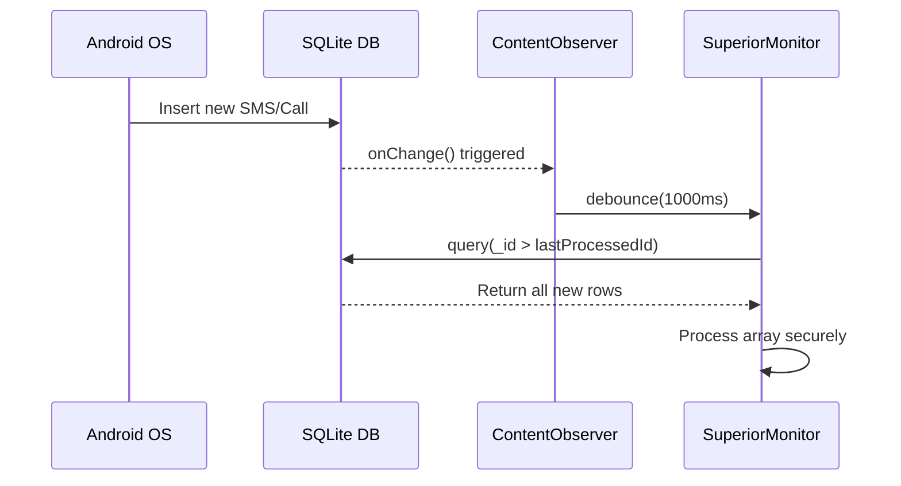

<h1 align="center">
  Backend Mechanics
</h1>

  <strong>Failsafe Logic, Data Integrity & Execution Loops</strong>

---

> [!NOTE]
> This document outlines the deeply technical backend implementation logic, architectural failsafes, and communication constraints required to maintain zero data loss and system stability.

---

## 1. Zero-Loss Communication Interception (SMS & Calls)

The `SmsMonitor` and `CallMonitor` do not rely on simple Broadcast Receivers alone, as they cannot reliably capture outgoing communications or fire reliably under heavy load.

### Strategy

- **ContentObserver Synchronization**: The modules register a `ContentObserver` on the native SQLite databases (`content://sms` and `CallLog.Calls.CONTENT_URI`).
- **Debouncing & Locking**: Because multiple inserts can trigger the observer rapidly, a coroutine delay (`delay(1000)` for SMS, `delay(3000)` for Calls) combined with Mutex locking (`processMutex.withLock`) ensures the database transaction finishes before reading.
- **The Zero-Loss Loop**: Instead of querying `LIMIT 1` (which loses messages if multiple arrive simultaneously), the query loops through all new rows: `while (cursor.moveToNext()) { if (_id > lastProcessedId) { ... } }`.
- **Clock Anomaly Protection**: Sorting during the polling loop is done strictly by the internal primary key in ascending order (`_id ASC`), preventing missed data caused by incorrect system timestamps or clock manipulation. (Note: SMS baseline initialization relies on `date DESC`).
- **Persistence Hardening**: The `lastProcessedId` baseline is strictly bound to encrypted `PrefsManager`. The system natively avoids volatile in-memory `-1L` states to guarantee flawless catch-up syncs following force-stops or reboots without data loss.

---

## 2. Root-Level Exfiltration & Native Polling (Social Updates)

### WhatsApp Exfiltration

Because WhatsApp uses end-to-end encryption, network interception is impossible. The application utilizes a root-level exfiltration of the unencrypted local SQLite databases.

#### Stat-Polling Shell

`libsu` is used to spawn a persistent root shell that executes `stat -c '%Y' /data/data/com.whatsapp/databases/msgstore.db-wal` every 300ms. This acts as a highly reliable file observer that bypasses SELinux context limits.

### Torn-Read Prevention

To prevent SQLite "database locked" errors and torn reads, the live database is never queried directly. Instead, `msgstore.db`, `msgstore.db-wal`, and `msgstore.db-shm` are copied to a secure internal `watchdir`.

> [!WARNING]
> **Critical Constraint**: All three files (`msgstore.db`, `msgstore.db-wal`, `msgstore.db-shm`) must be copied together. Deleting the `msgstore.db-shm` file while a Write-Ahead Log exists destroys the WAL index, resulting in missing or invisible recent messages.

### Instagram Direct Messages

Instagram utilizes standard SQLite databases, specifically `direct.db` in Journal Mode (not WAL).
- **Stat-Polling**: Uses native Kotlin flow coupled with shell `stat` on `direct.db` for lightweight polling.
- **Torn-Read Prevention**: Automatically copies `direct.db` and `direct.db-journal` into a secure `watchdir` via root to prevent read-locks with the live Instagram app.
- **BLOB Interception**: Safely checks `Cursor.FIELD_TYPE_BLOB` as Instagram dynamically stores payloads either as Strings or UTF-8 BLOBs, converting them seamlessly.
- **Timestamp Deduplication**: Employs timestamp baselining (`MAX(timestamp)`) instead of internal `_id` keys, alongside an in-memory `processedIds` `Set` to effectively counter Instagram's volatile row-deletion sync engine and duplicated `json_each` rows for group chats.

### Network-Aware Polling Suspension

To preserve battery life and CPU cycles during periods of network unavailability, the system hooks into `ConnectivityManager.NetworkCallback`. When the device loses internet connection, the aggressive 300ms polling loop is instantly suspended. Upon network restoration, a mandatory catch-up sync executes to securely capture any missed messages without data loss.

---

## 3. Media Operations & Microphone Safeties

The on-demand Media Operations feature includes duration-based microphone recording (1, 3, 5, 10 minutes) leveraging Android's Foreground Services.

### Audio Focus Listener

An `AudioManager.OnAudioFocusChangeListener` is registered. If the system grants audio focus to another high-priority app (like an incoming phone call or the camera opening), the `MediaRecorder` is aggressively paused or stopped to prevent crashes and file corruption.

### File Routing

Audio outputs are saved dynamically to `context.getExternalFilesDir("mediaops/microp_temp")` to avoid Scoped Storage restrictions. If the Telegram API is unreachable, they are routed to the offline queue.

---

## 4. Snapshot Engine Race Conditions

The `SnapshotEngine` coordinates background screen captures and camera captures via `AlarmManager`.

### Thread Safety

Because Android's Doze mode often clumps background alarms together, Front Camera and Rear Camera captures may execute simultaneously. To prevent file corruption, the temporary caches append facing IDs to the filename (e.g., `temp_front.jpg`, `temp_rear.jpg`) rather than using a static `temp.jpg`.

### Android 14 Alarm Fallback

`setExactAndAllowWhileIdle()` throws a fatal `SecurityException` if the user revokes exact alarm permissions. The application catches this exception and falls back to inexact alarms (`setAndAllowWhileIdle()`) to ensure core loops never die.

### Lock Screen Awareness

Before executing capture commands, the engine dynamically queries the `KeyguardManager` and `PowerManager`. Scheduled captures are aborted if the device screen is locked or off, preventing the generation of useless black images and significantly reducing battery/storage waste.

---

## 5. Telegram C2 & API Safeguards

### API Reachability & Failure Interception

`BotService` (and `BotActions`) strictly differentiate between local network connection and Telegram API reachability. If the device is online (connected to Wi-Fi) but the API actively rejects the message (e.g., ISP block, DNS drop), `TelegramApi.sendMessage` explicitly returns `false`. This boolean is intercepted by `OfflineManager` in real-time, instantly bypassing the void and routing the payload directly to the offline `.txt` queue.

### Markdown Escaping

To prevent `400 Bad Request` crashes, all user-generated strings (SMS bodies, WhatsApp messages, contact names) are wrapped in `TelegramApi.escapeMarkdown()` to close any orphaned control characters (`_`, `*`, `[`).

### Auto-Deletion

All interactive menus tracked by `BotCommands.kt` employ a 2-minute background coroutine countdown (`delay(2 * 60 * 1000L)`). If no button is pressed, the menu is automatically deleted to prevent a suspicious chat history footprint.

---

## 6. Authorization Intrusion Defense System

To prevent Denial of Service (DoS) attacks via Telegram API Rate Limits (`HTTP 429 Too Many Requests`), `BotActions.kt` features an automated intrusion defense system (`handleUnauthorizedAccess`).

### Memory-Efficient Design

- **LRU Cache**: Intruder tracking relies on a custom `LinkedHashMap` configured as an LRU (Least Recently Used) cache. It enforces a strict hard cap of 50 unique intruders. If a 51st unique attacker is detected, the oldest entry is dropped, preventing infinite memory growth.
- **Reboot-Stateless Defense**: Intrusion memory strictly resides in RAM. If the device reboots, cooldowns reset. This eliminates costly disk I/O or database writes for malicious requests.

### Defense Layers

- **3-Strikes Cooldown**: Direct messages are capped at 3 warning responses. Subsequent messages from that User ID are silently dropped and ignored at the Android level.
- **Auto-Leave Hijack Prevention**: If added to an unauthorized group chat, `BotActions` triggers `TelegramApi.leaveChat()` to permanently sever the connection and stop the spam loop instantly.

---

## 7. Persistent Network Enforcement

The `NetworkEnforcer` module implements a robust, fail-safe approach to maintaining network connectivity on boot.

### Boot-Time Evaluation

Upon `ACTION_BOOT_COMPLETED`, the enforcer:
1. Waits 2 seconds for system network services to initialize.
2. Evaluates each active toggle (Wi-Fi, Mobile Data, Hotspot) individually.
3. Wraps each evaluation in a `try-catch` block.
4. If any toggle fails to apply (due to missing permissions, OEM restrictions, etc.), that specific toggle is **automatically disabled** in preferences to prevent recurring boot-time crashes.

### Runtime State Enforcement

In addition to boot checks, the enforcer maintains continuous connectivity:
- **Mobile Data**: Registers a `ContentObserver` on `Settings.Global.CONTENT_URI` to detect when the OS turns off `mobile_data`. It waits 3 seconds and forcefully executes `svc data enable` via root.
- **Wi-Fi & Hotspot**: Employs a zero-polling `BroadcastReceiver` to intercept `WIFI_STATE_CHANGED` and `WIFI_AP_STATE_CHANGED`. If manually disabled by the user, it intercepts the broadcast, delays for 3 seconds, and re-establishes the connection natively.

### Hotspot Enforcement via Reflection

Enabling Hotspot programmatically requires bypassing Android's standard user prompts. The enforcer uses:
- **Dynamic Proxy Generation**: Creates a Java `Proxy` to satisfy the `OnStartTetheringCallback` interface required by `TetheringManager`.
- **Hidden API Access**: Invokes restricted `ConnectivityManager.startTethering()` via reflection.

> [!CAUTION]
> This approach is inherently fragile due to Android's hidden API restrictions and varying OEM implementations. The fail-safe auto-disable mechanism ensures the app remains stable even on incompatible devices.

---

## 8. Telemetry Intelligence

The `TelemetryCollector` gathers deep hardware and networking metrics to attach to `#Reboot` and `#Connection` alerts.

<strong>Expand Telemetry Details</strong>

- **Thermals & CPU**: Reads raw thermal zone nodes and CPU frequency nodes natively from `/sys/devices/`.
- **Battery Health**: Extracts design capacity and raw status codes from `/sys/class/power_supply/battery`.
- **Radio Signal**: Executes `dumpsys telephony.registry` to parse out precise RSRP (Reference Signal Received Power) values in dBm.

---

## 9. End-to-End Data Pipeline & Offline Lifecycle

To ensure zero data loss while remaining stealthy, all captured data follows a strict lifecycle from interception to Telegram delivery. Here is how the logic flows in simple terms:

### How Data is Sent
When a monitor (like SMS or Call) intercepts an event, it formats the raw data into a clean, markdown-escaped message. This payload is passed to the unified `TelegramApi.kt`, which handles the physical HTTP request to Telegram's servers.

### What Happens if Sending Fails (Offline Routing)
If the device loses internet access, the system physically ping-tests Telegram (`isApiReachable()`) to verify the connection is dead, and then reroutes the data locally:
- **Text Logs (SMS, Calls, WhatsApp)**: The formatted message text is appended to persistent `.txt` files (e.g., `offline_sms.txt` or `offline_calls.txt`) inside the app's internal cache.
- **Recordings & Snapshots**: Heavy files like call recordings (BCR) and scheduled camera shots are moved into categorized `offline/` directories (e.g., `mediaops/offline` or `camera/offline`).
- **On-Demand Commands**: If an admin manually requests a live Microphone recording and the upload fails, the audio is safely dropped into the offline queue to be synced later. (Note: On-demand live screen captures are simply deleted on failure, as they are meant for real-time viewing).

### What Happens When Connectivity is Restored (Offline Sync)
When the device connects back to the internet, `BotService` detects the network, waits for DNS stabilization, and initiates a Trickle-Sync via `OfflineManager`:
- **Text Logs & Fetch Backups**: The queued `.txt` files are uploaded as document attachments. Once Telegram confirms receipt, the local `.txt` file is **immediately deleted**.
- **Recordings & Audio**: Uploaded sequentially with a mandatory 2-second delay to avoid `HTTP 429` rate limits. Unlike other temporary files, upon success, call recordings are **not** deleted. Instead, they are securely moved to a hidden `permanent` storage directory on the device for long-term local retention.
- **Snapshots**: The engine counts the pending offline photos. If there are 1 to 4 photos, they upload individually. If there are **more than 4**, the system natively compresses them into a single `.zip` archive for a fast, bulk upload. Upon success, all original images are permanently deleted.

---

  Built with ❤️ by <a href="https://gitlab.com/sandeshsahu">@sandeshsahu</a>

